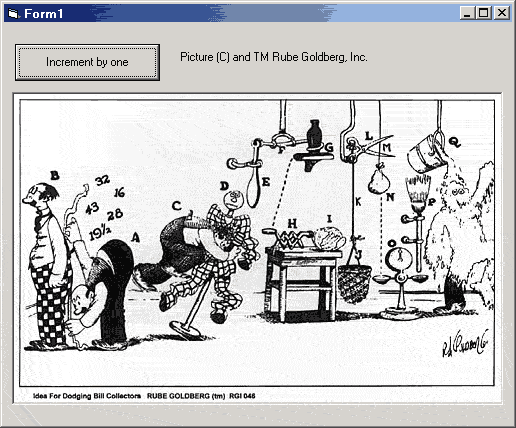

<div align="center">

## RGCC \- Increment by one


</div>

### Description

Increments an integer by one
 
### More Info
 
Integer


<span>             |<span>
---                |---
**Submitted On**   |
**By**             |[Bruce Pierson](https://github.com/Planet-Source-Code/PSCIndex/blob/master/ByAuthor/bruce-pierson.md)
**Level**          |Intermediate
**User Rating**    |4.3 (13 globes from 3 users)
**Compatibility**  |VB 6\.0
**Category**       |[Jokes/ Humor](https://github.com/Planet-Source-Code/PSCIndex/blob/master/ByCategory/jokes-humor__1-40.md)
**World**          |[Visual Basic](https://github.com/Planet-Source-Code/PSCIndex/blob/master/ByWorld/visual-basic.md)
**Archive File**   |[](https://github.com/Planet-Source-Code/bruce-pierson-rgcc-increment-by-one__1-24858/archive/master.zip)


### Source Code

```
'================================
'OK, all. Here's the first challenge,
'informally put out (without his
'knowledge or consent) by Intensify:
'================================
'--Scope of project:
'INCREMENT BY ONE
'
'--Returns:
'Value incremented by one
'
'--Challenge:
'Try to top this one, I didn't try
'TERRIBLY hard, b/c I do have a
'real job...
'
'--Constraints:
'Rule #1: "Looping for the express
'purpose of adding time to an
'algorithm is expressly forbidden."
'
'--Seriously:
'PLEASE keep these submissions in
'the 'Jokes/Humor' category to make
'sure that PSC does continue to be
'taken seriously.
'***********************************
'RGCC (Rube Goldberg Coding Contest)
'EULA:
'The code herein is copyrighted.
'
'Feel free to use this code
'in your applications. If you
'do, send payment (first month's
'lease) to me for each application
'that you distribute.
'
'You will be sent a monthly bill
'for each license of your application
'that you distribute. If you do
'not pay this bill, all licenses
'to this software will be revoked
'and Guido from the Software
'Publisher's Association will be
'paying a visit to your home.
'In addition, the users' copies of
'the software will cease to operate,
'and their virus protection software
'will be automatically deactivated.
'
'************************************
'====================
'Place this code on a form and
'add a command button
'====================
Option Explicit
Private Sub Command1_Click()
 Dim NumberThatIWantToIncrement As Integer
 NumberThatIWantToIncrement = _
   InputBox("Number to increment by 1: ", "Increment a Number")
 NumberThatIWantToIncrement = _
   IncrementAnIntegerByTheValueOfOne(NumberThatIWantToIncrement, _
   "<<Your string goes here - ANY string will work!>>")
 MsgBox NumberThatIWantToIncrement
End Sub
'====================
'Place this code in a standard module
'====================
'********************
'Requires a reference to Microsoft
'ActiveX Data Objects 2.x
'********************
Option Explicit
Public Function IncrementAnIntegerByTheValueOfOne _
(ByVal TheOriginalNumber As Integer, _
ByVal TheStringToPassInWillBeThis As String) As Integer
 Dim FirstCharacterOfTheStringPassedIn As String * 1
 Dim ASCIIValueOfTheFirstCharacterOfTheStringPassedIn As Integer
 Dim ValueOfOne As Integer
 FirstCharacterOfTheStringPassedIn = _
   GetTheFirstCharacterOfTheString(TheStringToPassInWillBeThis)
 ASCIIValueOfTheFirstCharacterOfTheStringPassedIn = _
   Asc(FirstCharacterOfTheStringPassedIn)
 ValueOfOne = _
   ASCIIValueOfTheFirstCharacterOfTheStringPassedIn - _
   (ASCIIValueOfTheFirstCharacterOfTheStringPassedIn - 1)
 IncrementAnIntegerByTheValueOfOne = TheOriginalNumber + ValueOfOne
End Function
Public Function GetTheFirstCharacterOfTheString(ByVal TheOriginalString As String) As String
 Dim StringToReturn As String * 1
 Dim TheRecordsetToHoldTheString As ADODB.RecordSet
 Set TheRecordsetToHoldTheString = New ADODB.RecordSet
 '---Note here, the clever use of the 'With' keyword to cut down on verbosity...
 With TheRecordsetToHoldTheString
  .Fields.Append "StringName", adVarChar, 100
  .Open
  .AddNew "StringName", TheOriginalString
 End With
 StringToReturn = _
   Chr(Asc(Right(TheRecordsetToHoldTheString.Fields(0).Value, _
   Len(TheRecordsetToHoldTheString.Fields(0).Value) - 1)))
 GetTheFirstCharacterOfTheString = StringToReturn
End Function
```

